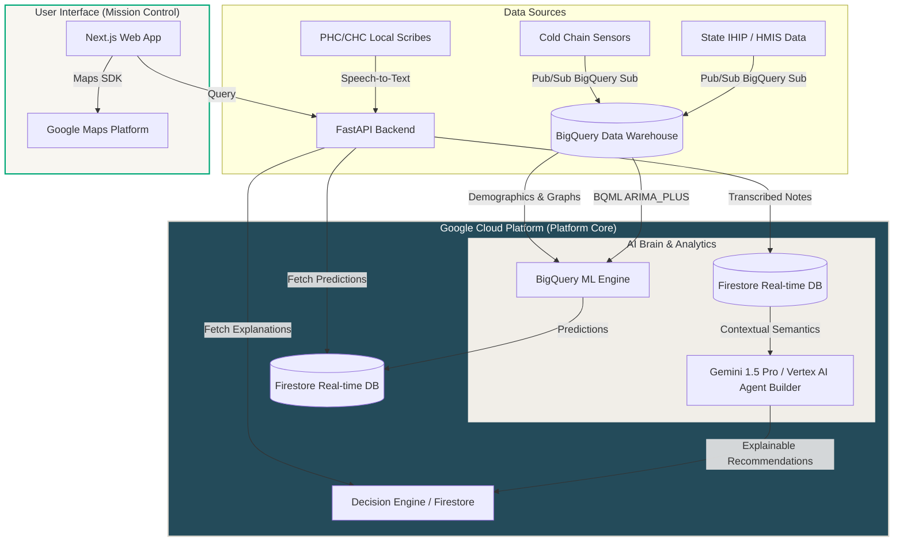

# GroundTruth AI 📡

> **"Seeing the people healthcare can't."**

GroundTruth AI is a national-level, **AI-First Healthcare Intelligence Platform** designed to solve critical public health operational vulnerabilities before they escalate into crises. 

Instead of showing yesterday's hospital statistics, GroundTruth AI continuously analyzes multi-modal signals to forecast **tomorrow's medicine stockouts, patient surges, nurse burnout, and silent dropouts** across rural Primary Health Centres (PHCs) and Community Health Centres (CHCs).

---

## 🧭 Core Philosophy & Differentiator

Traditional Hospital Management Information Systems (HMIS) only record what has already happened. GroundTruth AI acts as an **AI Operating System for District Health Administrators**, shifting operations from *reactive administration* to *proactive crisis prevention*.

| Dynamic Operational Risk | Traditional HMIS (Reactive) | GroundTruth AI (Proactive) |
| :--- | :--- | :--- |
| **Medicine Stockouts** | Reorder when inventory is zero. | Forecasts 14-day stock runs; proposes reallocations. |
| **Patient Footfall** | Manage long queues at clinic registration. | Redirects non-critical cases; optimizes shifts. |
| **Staff Allocation** | Request new postings (months turnaround). | Reallocates staff temporarily during surge windows. |
| **Chronic Care Care** | Count clinic patient totals. | Flags high-risk dropouts before they miss visits. |

---

## 🎨 Visual Design System

GroundTruth AI features a clean, Scandinavian-minimalist civic-tech theme. It intentionally rejects neon-futuristic dark mode/AI tropes in favor of an authoritative, non-fatiguing interface.

*   **Primary Accent**: Midnight Petrol Blue (`#244B5A`) — Trust, public infrastructure.
*   **Success Indicator**: Emerald Jade (`#00A878`) / Forest Moss (`#2E7D5A`) — Healthy communities.
*   **Alert Indicator**: Copper Amber (`#C7772F`) / Terracotta Clay (`#A24B36`) — Forecast signals.
*   **Background**: Warm Porcelain (`#F8F6F1`)
*   **Containers**: Soft Stone (`#F1EEE8`)
*   **Typography**: Graphite (`#2C3138`) and Slate Ash (`#6A737B`)

---

## ⚡ Core System Architecture



---

## 🌟 Key MVP Features

1.  **District Health Risk Radar**: An interactive geographical GIS interface mapping clinics and their risk indicators over a rolling 14-day timeline.
2.  **What-If Simulator**: A sandbox for policy planners to run Monte Carlo simulations (e.g., redistributing supplies or doctors) and preview feasibility scores and wait-time impacts.
3.  **Speech-to-Insights Scribe**: A multi-lingual (Hindi/Marathi/English) recorder that translates clinical consultations and parses them into structured HL7 FHIR Observation JSONs.
4.  **Active Interventions Queue**: A dispatch ledger for District Health Officers to approve and execute logistical redistributions.

---

## 📁 Repository Directory Structure

```
groundtruth-ai/
├── README.md                    # Root project documentation
├── firestore.rules              # Secure DB access rules
├── firestore.indexes.json       # DB composite indexing specifications
├── logo_presentation.html       # Interactive Brand spec sheet
├── apps/
│   └── web/                     # Next.js Command Center App (React/TS)
│       ├── src/app/globals.css  # Civic-tech design tokens
│       ├── src/app/page.tsx     # Active client UI pages
│       └── public/              # Brand SVG vectors & favicons
├── services/
│   └── backend/                 # FastAPI Core Server (Python)
│       ├── main.py              # Main REST routes & simulation drivers
│       ├── requirements.txt     # Python packages
│       └── Dockerfile           # Cloud Run deployment config
└── ml-pipeline/
    ├── bootstrap_synthetic.py   # Seeder script generating 100k rows
    └── train_forecasting.py     # BigQuery ML ARIMA model training query
```

---

## 🗄️ Database & Analytics Schema

### Firestore Collections (Real-time App State)
*   **`/facilities/{facilityId}`**: Metadata on hospital staff counts, location, bed capacity, and stock thresholds.
*   **`/predictions/{predictionId}`**: AI-generated time-series prediction logs containing the target risk, target date, confidence level, and Gemini-based Explainable AI (XAI) descriptions.
*   **`/interventions/{interventionId}`**: Pending and active transport dispatches with status tracking (`PENDING` -> `EXECUTED`).

### BigQuery Tables (Historical Warehouse)
*   **`health_events_flat`**: Patient age, symptoms array, prescribed medicines, and SNOMED classification codes.
*   **`inventory_daily_snapshots`**: Date, facility, medicine ID, stock level, issued quantity, and received quantities.

---

## 🛠️ Local Development & Quick Start

### 1. Ingest Mock Datasets
Generate 100,000 synthetic records simulating historical clinical diagnoses and daily inventory levels:
```bash
python ml-pipeline/bootstrap_synthetic.py
```
This generates:
*   `inventory_daily_snapshots.csv` (Supply logs)
*   `health_events_flat.csv` (Patient case logs)
*   `firestore_seed_data.json` (Clinic base setups)

### 2. Set Up the Backend API
Start the FastAPI server:
```bash
cd services/backend
pip install -r requirements.txt
python main.py
```
*   Server runs at: `http://127.0.0.1:8080`
*   Interactive OpenAPI documentation: `http://127.0.0.1:8080/docs`

### 3. Start the Next.js Frontend
Start the web development server:
```bash
cd apps/web
npm install
npm run dev
```
*   Access the interface at: `http://localhost:3000`

---

## 🚀 Cloud Native Deployment Flow

The system leverages **Google Cloud Platform** for production scale:
*   **Backend & Frontend**: Scaled on **Cloud Run** in containerized environments.
*   **Data Pipelines**: Log streams are piped directly from State Health Portals to **Cloud Pub/Sub**, utilizing native **BigQuery Direct Subscriptions** to write data without cold-start latency.
*   **Privacy**: **Cloud DLP API** masks patient identifiers inline.
*   **Time-Series Forecasting**: **BigQuery ML ARIMA_PLUS** models train on warehouse metrics in SQL, outputting new forecasts directly into **Firestore** via event triggers.
